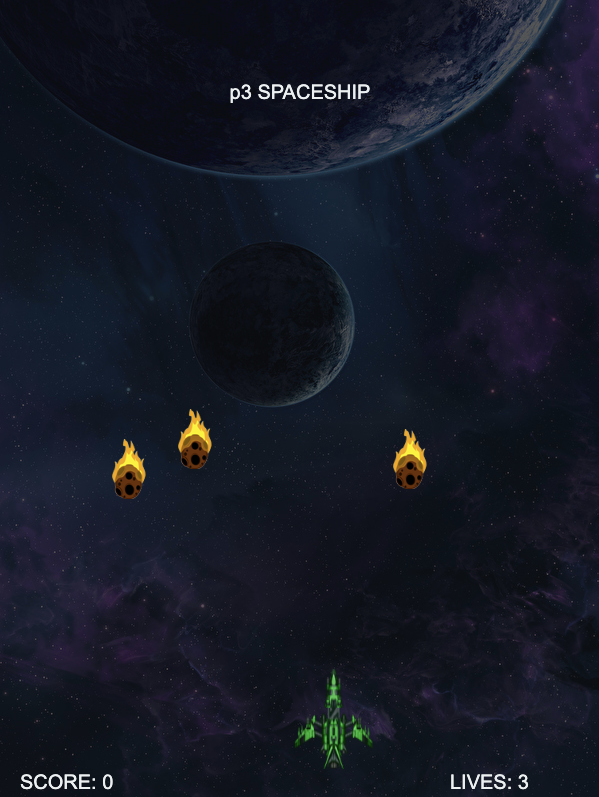

# WEB Spaceship Game

An exciting spaceship game developed in JavaScript for the web. Control a spaceship, dodge meteors, and shoot them to earn points. Avoid collisions to stay alive and achieve the highest score.



## Contents
- [About the Game](#about-the-game)
- [Game Controls](#game-controls)
- [Game Rules](#game-rules)
- [Installation](#installation)
- [Usage](#usage)
- [Technologies](#technologies)

## About the Game
In this spaceship game, you control a spaceship navigating an infinite space filled with meteors. Your goal is to shoot as many meteors as possible while avoiding collisions. You start the game with 6 lives, and the game ends when your lives drop to 0.

## Game Controls
- **Left Arrow (⬅️):** Move the spaceship left
- **Right Arrow (➡️):** Move the spaceship right
- **Up Arrow (⬆️):** Move the spaceship forward
- **Down Arrow (⬇️):** Move the spaceship backward
- **Spacebar:** Shoot bullets from the spaceship

## Game Rules
1. **Dodge Meteors:** Move your spaceship to avoid falling meteors.
2. **Shoot Meteors:** Press the spacebar to shoot bullets at the meteors and earn points.
3. **Earn Points:** You get one point for each meteor you shoot down.
4. **Lose Lives:** You lose a life if a meteor hits your spaceship or reaches the bottom of the screen.

## Installation
To run this game on your own website, follow these steps:

1. **Clone the repository:**
    ```sh
    git clone https://github.com/prod3v3loper/web-spaceship-game.git
    ```
2. **Navigate to the project directory:**
    ```sh
    cd web-spaceship-game
    ```
3. **Include the game files in your website:**

   Copy the entire project directory to the desired location in your website's directory structure.

## Usage
To embed the game into your website, add the following HTML to your webpage:

```html
<!DOCTYPE html>
<html lang="en">

<head>
    <meta charset="UTF-8">
    <meta name="viewport" content="width=device-width, initial-scale=1.0">
    <title>p3 GAME</title>
    <link rel="stylesheet" href="css/spaceship.css">
</head>

<body>

    <button class="bt btn-secondary" id="p3-game-btn"><i class="fa fa-dice"></i>START GAME</button>

    <div id="p3-game" class="grid-12">
        <canvas width="600" height="800"></canvas>
        <button id="restart" onclick="restart();">PLAY AGAIN</button>
        <button id="start" onclick="start();">START</button>
        <button id="stop" onclick="stop();">STOP</button>
    </div>

    <script src="js/spaceship.js"></script>
</body>

</html>
```

# Technologies

- JavaScript: The primary programming language used for game logic.
- HTML5 Canvas: Used for rendering the game graphics.
- CSS: For basic styling.

# ISSUE

Please use the issue tab to request a:

* Bug
* Feature

Choose template and report a bug or feature you want [issues](https://github.com/prod3v3loper/web-spaceship-game/issues).

# CONTRIBUTE

Please read the [contributing](https://github.com/prod3v3loper/web-spaceship-game/blob/master/.github/CONTRIBUTING.md) to contribute.

# VULNERABILITY

Please use the Security section for privately reporting a [vulnerability](https://github.com/prod3v3loper/web-spaceship-game/security).

# Authors

**[PROD3V3LOPER](https://www.prod3v3loper.com)** - _All works_

# License

[MIT](https://github.com/prod3v3loper/web-spaceship-game/blob/master/LICENSE)